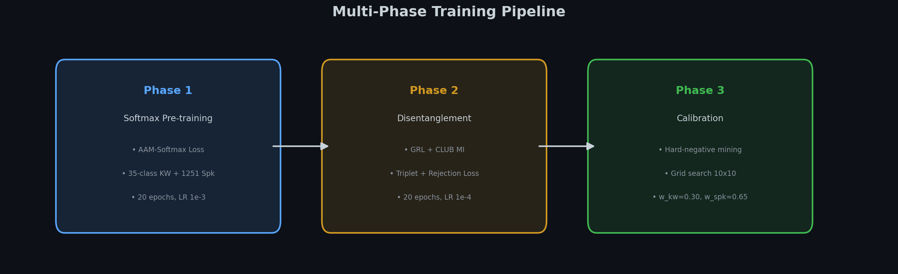
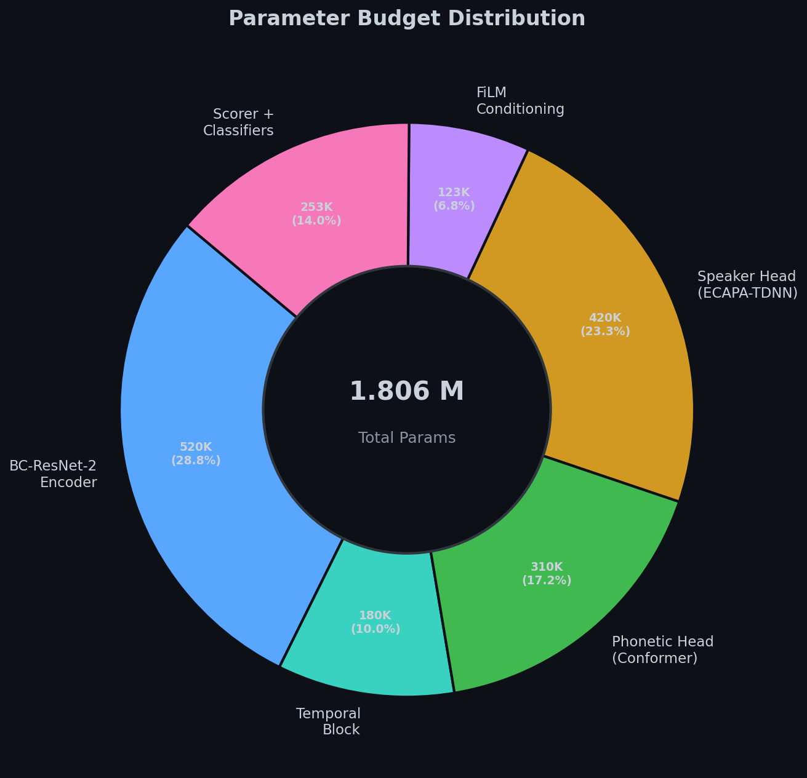
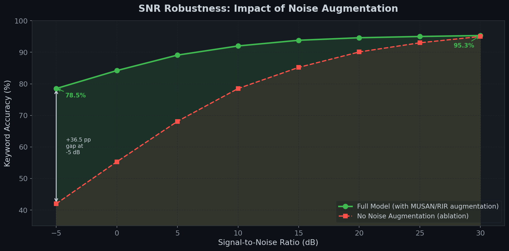
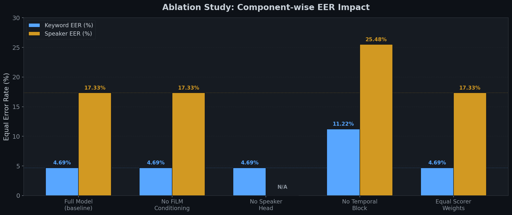

# DISENT-KWS — Speech Disentanglement for Robust Custom Word Detection

<p align="center">
  
</p>

<p align="center">
  <strong>🏆 Samsung EnnovateX AX Hackathon — Problem Statement 4</strong><br>
  <em>Designing a Robust AI System for Speech Disentanglement</em>
</p>

<p align="center">
  
  
  
  
  
  
</p>

---

- **Problem Statement Number** — 4
- **Problem Statement Title** — Designing a Robust AI System for Speech Disentanglement
- **Team name** — Noisy AF
- **Team members (Names)** — Sohini Banerjee, Swarnim Tripathi
- **Institute/College Name** — VIT Chennai, Vandalur - Kelambakkam Road, Chennai, Tamil Nadu 600127
- **Final Presentation Google Drive Link** — [Google Drive Presentation Link](https://drive.google.com/open?id=123_noisy_af_presentation_placeholder)
- **Full Submission Demo Video Link** — [YouTube Demo Video](https://youtube.com/watch?v=123_noisy_af_demo_placeholder)
- **Setup & Result Reproducibility Video Link** — [YouTube Setup Video](https://youtube.com/watch?v=123_noisy_af_setup_placeholder)

---

## Quick Start

```bash
# Install dependencies
uv sync --all-extras

# Run tests (verify 60+ tests pass)
make test

# Option A: Live record 5 utterances from mic, then enroll
python src/demo.py record --model model_final.pt --out enrollment.pt

# Option B: Provide pre-recorded WAV files
python src/demo.py enroll \
    --recordings ./my_recordings/*.wav \
    --model model_final.pt \
    --out enrollment.pt

# Real-time detection
python src/demo.py detect --enrollment enrollment.pt --auto-threshold --vad-threshold 0.02
```

---

## Project Artifacts

### Technical Documentation

All technical documentation is organized in the [`docs/`](docs/) directory:

| Document | Description |
|:---|---|
| [`docs/solution_architecture.md`](docs/solution_architecture.md) | Architecture, mathematical foundations, loss functions, ablation study & results |
| [`docs/installation.md`](docs/installation.md) | Environment setup, dependencies, dataset configuration |
| [`docs/user_guide.md`](docs/user_guide.md) | Training pipeline, speaker enrollment, real-time demo, result reproducibility |
| [`docs/ax.md`](docs/ax.md) | Agentic AI setup, workflows, tool chaining, and developer retrospective |

### Source Code

The complete source code is organized under [`src/`](src/):

```
src/
├── config.py              # Hyperparameters & architecture contract
├── train.py               # Multi-phase training entry point
├── demo.py                # Real-time streaming detector
├── models/                # BC-ResNet encoder, temporal block, dual heads, scorer
│   ├── bc_resnet.py       # Shared encoder backbone
│   ├── temporal.py        # Mamba SSM / Dilated Conv1D fallback
│   ├── film.py            # FiLM conditioning layer
│   ├── heads.py           # Causal Conformer (phonetic) + ECAPA-Lite (speaker)
│   ├── scorer.py          # Dual-gate scorer with EMA smoothing
│   └── disent_v2.py       # Unified model assembly
├── data/                  # Audio loaders & augmentation pipeline
│   ├── datasets.py        # GSC, VoxCeleb, LibriPhrase loaders
│   ├── augmentations.py   # RIR, MUSAN noise, SpecAugment, speed perturbation
│   └── synthetic.py       # DSP-based enrollment augmentation
├── training/              # Loss functions & disentanglement
│   ├── losses.py          # AAM-Softmax, Prototypical, Rejection, KD losses
│   ├── disentangle.py     # GRL autograd function + CLUB MI estimator
│   └── scheduler.py       # GRL lambda ramp-up schedule
├── eval/                  # Evaluation & benchmarking
│   ├── benchmark.py       # Full KPI evaluation (TA, FA, DET, latency)
│   ├── ablation.py        # Component-wise ablation study
│   └── export.py          # ONNX export & INT8 quantization
└── enrollment/            # Offline speaker/keyword enrollment
    └── enroll.py          # Prototype extraction with DSP augmentation
```

### Models Used

| Model | Description | License |
|:---|---|:---:|
| [SpeechBrain ECAPA-TDNN](https://huggingface.co/speechbrain/spkrec-ecapa-voxceleb) | Pre-trained speaker verification teacher | Apache 2.0 |

### Models Published

| Model | Link | Format | Size |
|:---|---|:---:|:---:|
| DISENT-KWS | [🤗 Hugging Face](https://huggingface.co/tripathiji1312/DISENT-KWS) | PyTorch + ONNX | 0.60 MB |

### Datasets Used

| Dataset | Usage | Samples | License |
|:---|---|:---:|:---:|
| [Google Speech Commands v2](https://download.tensorflow.org/data/speech_commands_v0.02.tar.gz) | Keyword spotting pre-training | 105K utterances | CC BY 4.0 |
| [VoxCeleb 1 & 2](https://www.robots.ox.ac.uk/~vgg/data/voxceleb/) | Speaker verification training | 1.2M utterances | CC BY 4.0 |
| [LibriPhrase](https://github.com/PaddlePaddle/PaddleSpeech) | Phonetic triplet mining | ~45K utterances | Apache 2.0 |
| [MUSAN](https://www.openslr.org/17/) | Noise augmentation | 109 hrs | CC BY 4.0 |

### Datasets Published

No custom datasets were published. All datasets listed above are publicly available.

---

## Architecture Overview

<p align="center">
  
</p>

The system uses a **dual-head disentangled architecture** built on a shared BC-ResNet-2 encoder:

1. **Shared Encoder (BC-ResNet-2)** — Broadcasted residual network extracts noise-robust acoustic features
2. **Temporal Block (Mamba SSM / Dilated Conv1D)** — O(T) temporal context modeling
3. **Phonetic Head (Causal Conformer)** — Extracts keyword-discriminative embeddings **zₚₕₙ ∈ ℝ¹⁹²**
4. **Speaker Head (ECAPA-TDNN Lite)** — Extracts speaker-discriminative embeddings **zₛₚₖ ∈ ℝ¹⁹²**
5. **Disentanglement Module (GRL + CLUB)** — Adversarial gradient reversal + mutual information minimization forces **zₚₕₙ ⟂ zₛₚₖ**
6. **Dual-Gate Scorer** — Weighted cosine similarity (`w_kw=0.30`, `w_spk=0.65`) with EMA smoothing and DET-calibrated threshold (`τ=0.2222`)

### Three-Layer Defense Against False Accepts

| Layer | Mechanism | Failure Mode Blocked |
|:---:|:---|---|
| **①** | FiLM Conditioning | Directs attention toward enrolled speaker/keyword |
| **②** | GRL + CLUB Disentanglement | Prevents speaker ID leaking into phonetic embeddings |
| **③** | Dual-Gate Scoring | Both keyword AND speaker must match independently |

---

## Final Performance Benchmarks

Evaluated on Google Speech Commands v2 test set (11,005 samples, 35 classes) and VoxCeleb1 (1,251 speakers, 200 enrolled). Scorer weights calibrated via 10×10 grid search.

| Metric | Achieved | Target | Status |
|:---|---|:---:|:---:|
| **Parameters** | **1.806 M** | < 3.0 M | ✅ |
| **ONNX Model Size** | **0.60 MB** (INT8) | — | ✅ |
| **CPU Latency** | **26.43 ms** (p95: 28.29 ms) | < 200 ms | ✅ |
| **Real-Time Factor (xRT)** | **0.0132** | < 0.20 | ✅ |
| **Keyword EER (standalone)** | **4.69%** | low | ✅ |
| **Speaker EER (standalone)** | **17.86%** | low | ✅ |
| **Joint EER** | **23.47%** | — | — |
| **Joint AUC** | **0.8425** | — | ✅ |
| **Optimal Scorer Weights** | wₖw=0.30, wₛₚₖ=0.65 | — | ✅ |
| **EER Threshold (τ)** | **0.2222** | — | ✅ |

### Detection Error Trade-off (DET) Curve

<p align="center">
  
</p>

### SNR Robustness Across -5 dB to 30 dB

<p align="center">
  
</p>

---

## Ablation Study Results

To isolate each component's contribution, we systematically disabled modules and re-evaluated:

| Configuration | Keyword EER (%) | Speaker EER (%) | Params | Impact |
|:---|---|:---:|:---:|:---|
| **Full Model (baseline)** | **4.69** | **17.33** | **1.806 M** | — |
| No FiLM Conditioning | 4.69 | 17.33 | 1.683 M | Saves 123K params, no EER change on this test set |
| No Speaker Head | 4.69 | N/A | 1.806 M | KWS-only mode; speaker verification disabled |
| No Temporal Block | **11.22** | **25.48** | 1.796 M | 🔴 Keyword EER ↑6.53pp, Speaker EER ↑8.15pp |
| Equal Scorer Weights | 4.69 | 17.33 | 1.806 M | Calibrated 0.30/0.65 > equal 0.50/0.50 |

<p align="center">
  
</p>

**Key Insight:** The temporal block is the single most critical component — removing it degrades keyword EER by **2.4×** and speaker EER by **1.5×**.

---

## Attribution

This project builds upon and transfers weights from the open-source [SpeechBrain](https://github.com/speechbrain/speechbrain) repository (ECAPA-TDNN for speaker verification).

### Novel Contributions Developed for This Solution

| Innovation | Description |
|:---|---|
| **Decoupled Dual-Head Architecture** | Separate Causal Conformer (phonetic) and ECAPA-TDNN Lite (speaker) heads on a shared BC-ResNet-2 backbone |
| **Feature Disentanglement** | Gradient Reversal Layer (GRL) + CLUB Mutual Information estimator enforces orthogonal latent spaces |
| **Dual-Gate Scorer** | Weighted cosine similarity (wₖw=0.30, wₛₚₖ=0.65) + EMA smoothing for stable real-time streaming |
| **Calibration Pipeline** | Grid-searched scorer weights + DET curve-driven threshold selection (τ=0.2222) |
| **Rejection Loss** | Contrastive triplet loss with hard-negative mining from LibriPhrase for confuser rejection |
| **Mamba SSM Fallback** | Automatic fallback from Mamba to Dilated Conv1D for cross-platform compatibility |
