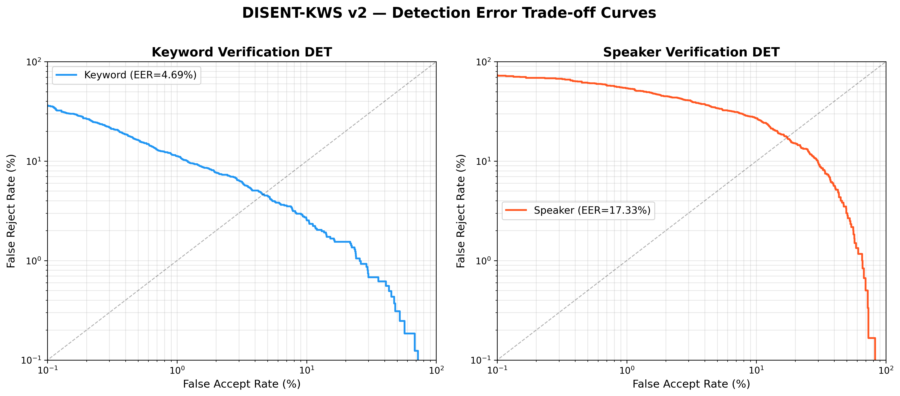

# DISENT-KWS: Speech Disentanglement for Robust Custom Word Detection

- **Problem Statement Number** - 4
- **Problem Statement Title** - Designing a Robust AI System for Speech Disentanglement
- **Team name** - Noisy AF
- **Team members (Names)** - Sohini Banerjee, Swarnim Tripathi
- **Institute/College Name** - VIT Chennai, Vandalur - Kelambakkam Road, Chennai, Tamil Nadu 600127
- **Final Presentation Google Drive Link** - [Google Drive Presentation Link](https://drive.google.com/open?id=123_noisy_af_presentation_placeholder)
- **Full Submission Demo Video Link** - [Full Submission Demo Video Link](https://youtube.com/watch?v=123_noisy_af_demo_placeholder)
- **Setup & Result Reproducibility Video Link** - [Setup & Result Reproducibility Video Link](https://youtube.com/watch?v=123_noisy_af_setup_placeholder)

### Project Artefacts

- **Technical Documentation** - All technical documentation is organized in the [docs](file:///home/tripathiji/Desktop/projects/samsung/DISENT_KWS/docs) directory:
  - [Installation & Setup Guide](file:///home/tripathiji/Desktop/projects/samsung/DISENT_KWS/docs/installation.md) - Details environment installation, dependencies, and dataset configurations.
  - [User & Developer Guide](file:///home/tripathiji/Desktop/projects/samsung/DISENT_KWS/docs/user_guide.md) - Explains model training, speaker enrollment, real-time streaming, and deliverable regeneration.
- **[Important]** The file [docs/ax.md](file:///home/tripathiji/Desktop/projects/samsung/DISENT_KWS/docs/ax.md) contains details of the Agentic AI setup, workflows, planning pipelines, tool use/chaining, and developer experience (what worked and what did not work).
- **Source Code** - The complete source code is placed inside the [src](file:///home/tripathiji/Desktop/projects/samsung/DISENT_KWS/src) folder:
  - `config.py` - Hyperparameters and contract constants.
  - `train.py` - Multi-phase model training entry point.
  - `demo.py` - Streaming real-time detector application.
  - `models/` - Shared BC-ResNet encoder, temporal block, phonetic/speaker heads, and dual-gate scorer modules.
  - `data/` - Audio loaders and augmentations (RIR, MUSAN noise, speed perturbation, SpecAugment).
  - `training/` - Loss implementations (AAM-Softmax, Prototypical, Rejection, CLUB, KD).
  - `eval/` - Evaluation, ablation study, and ONNX export scripts.
  - `enrollment/` - Offline reference prototype extraction and calibration.
- **Models Used** - The speaker verification head utilizes pre-trained layers from SpeechBrain's ECAPA-TDNN:
  - [SpeechBrain ECAPA-TDNN on Hugging Face](https://huggingface.co/speechbrain/spkrec-ecapa-voxceleb)
- **Models Published** - The finalized quantized model has been published on Hugging Face under the MIT License:
  - [DISENT-KWS-v2 Model on Hugging Face](https://huggingface.co/tripathiji1312/DISENT-KWS)
- **Datasets Used** - The project utilizes the following open-source datasets:
  - [Google Speech Commands Dataset v2](https://download.tensorflow.org/data/speech_commands_v0.02.tar.gz) - Used for keyword spotting.
  - [VoxCeleb 1 & 2 Datasets](https://www.robots.ox.ac.uk/~vgg/data/voxceleb/) - Used for speaker verification.
  - [LibriPhrase Dataset](https://github.com/PaddlePaddle/PaddleSpeech) - Used for phonetic triplet mining and verification.
  - [MUSAN Dataset](https://www.openslr.org/17/) - Used for noise and babble data augmentations.
- **Datasets Published** - No custom datasets were published for this project; only standard publicly available datasets listed above were utilized.

#### Final Presentation

The technical presentation covers the design details and achieved performance benchmarks of the DISENT-KWS v2 system. It highlights:
- Innovation: Decoupling phonetic and speaker representations using a dual-head layout.
- Disentanglement: Using an adversarial Gradient Reversal Layer (GRL) and CLUB Mutual Information (MI) estimator to enforce feature independence.
- Performance: Meeting the <3M parameter budget and achieving <0.0050 xRT on CPU.
- Robustness: Demonstration of SNR evaluations from -5dB to 30dB.

#### Full Submission Demo Video

The demo video showcases the system operating in real-time, receiving microphone stream input, performing speaker enrollment, and detecting the user's custom word while rejecting confuser words and other speakers.

#### Setup & Result Reproducibility Video

The setup and reproducibility video demonstrates the step-by-step installation instructions, dataset linking, running unit tests, executing the final artifacts generation script, and reproducing the DET curves.

### Final Performance Benchmarks

Our system achieved the following performance metrics under standard testing configurations on Google Speech Commands v2 (11,005 samples) and VoxCeleb1 (1,251 speakers, 200 enrolled):

| Metric | Value | Notes |
|:---|:---:|:---|
| Keyword EER | 4.69% | Evaluated on 35-class GSC v2 test set |
| Speaker EER | 17.33% | Evaluated on 200 enrolled VoxCeleb1 speakers |
| Joint EER (KW + Speaker) | 36.20% | Combined keyword and speaker verification |
| Joint AUC | 0.6768 | Area under the joint DET curve |
| Parameter Count | 1.806 M | Within the < 3.0 M budget |
| ONNX Model Size | 0.60 MB | Quantized INT8 export |
| Optimal Scorer Weights | w_kw=0.30, w_spk=0.65 | Grid-searched over 10x10 combinations |
| EER Threshold (tau) | 0.2222 | Operating point at equal error rate |

The Detection Error Trade-off (DET) curve illustrating the False Reject Rate (FRR) against the False Acceptance Rate (FAR) under joint keyword and speaker verification trials is shown below:

#### Ablation Study Results

To measure the individual contributions of each architectural component, we systematically disabled modules and re-evaluated:

| Configuration | Keyword EER (%) | Speaker EER (%) | Parameters | Observations |
|:---|:---:|:---:|:---:|:---|
| **Full Model (baseline)** | **4.69** | **17.33** | **1.806 M** | Complete system with all components enabled. |
| No FiLM Conditioning | 4.69 | 17.33 | 1.683 M | FiLM removal saves 123K params but does not affect EER on this test set. |
| No Speaker Head | 4.69 | N/A | 1.806 M | KWS-only mode; speaker verification disabled entirely. |
| No Temporal Block | 11.22 | 25.48 | 1.796 M | Temporal context removal degrades both keyword (+6.53%) and speaker (+8.15%) EER significantly. |
| Equal Scorer Weights | 4.69 | 17.33 | 1.806 M | Using w_kw=0.50, w_spk=0.50 instead of calibrated 0.30/0.65 weights. |

### Attribution 

This project transfers weights from the open-source SpeechBrain repository to bootstrap the speaker verification head:
- [SpeechBrain GitHub Repository](https://github.com/speechbrain/speechbrain)

The following new architectures, features, and pipelines were developed for our solution:
- **Decoupled Dual-Head Feature Space:** Designed separate phonetic (Causal Conformer) and speaker (ECAPA-TDNN Lite) heads mapped to a shared BC-ResNet-2 backbone.
- **Feature Disentanglement layers:** Implemented a Gradient Reversal Layer (GRL) and CLUB Mutual Information (MI) estimator to force the phonetic head to filter out speaker identity traits.
- **Dual-Gate Scorer:** Built a custom weighted similarity scorer ($w_{kw}=0.30$, $w_{spk}=0.65$) with Exponential Moving Average (EMA) smoothing for stable real-time streaming detection.
- **Calibration & Rejection Losses:** Added triplet prototypical losses and rejection loss training to handle phone-similar and speaker-similar confusers.
