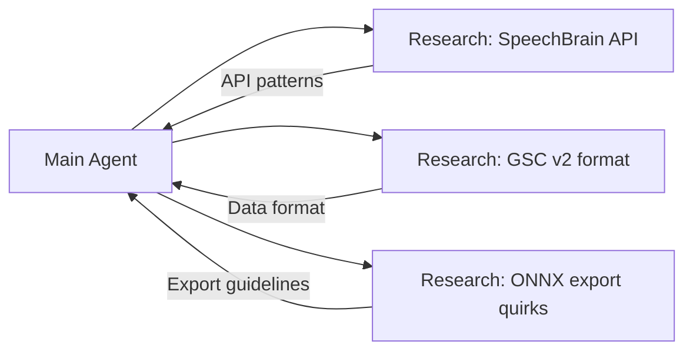
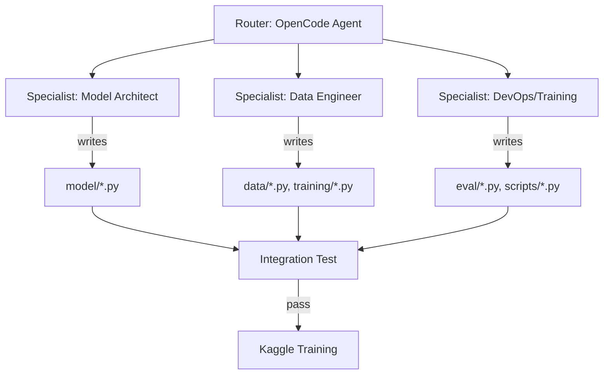

# Agentic AI and Development Tools Report

This report explains the utilization of Agentic AI, large language model reasoning engines, cloud notebook environments, automated workflows, and developer experience insights in implementing and optimizing the **DISENT-KWS** system for the Samsung EnnovateX AX Hackathon.

---

## 1. Agentic AI Setup and Developer Tools

The system was developed using a multi-layered agentic stack comprising a developer agent harness, an LLM reasoning backend, skill-based tool augmentation, and cloud execution interfaces:

### 1.1 Agent Harness: OpenCode (Antigravity)

**OpenCode** served as the primary agentic execution harness — the "hands" of the operation. It provided:

- **Filesystem tools**: Read, write, edit, glob, and grep operations for navigating and manipulating the codebase
- **Shell execution**: Running unit tests, training scripts, linting, and ONNX verification directly from the agent context
- **Task spawning**: Delegating parallel sub-agents for codebase exploration without blocking the main reasoning flow
- **Skill injection**: Loading specialized skill definitions (e.g., docx generation, frontend design, PDF manipulation) on demand to augment the agent's capabilities

OpenCode automates environment inspection, directory navigation, code modification, test suite execution, and file relocation. Equipped with these tool primitives, it translated architectural requirements from the reasoning engine into concrete, runnable source code.

### 1.2 Reasoning Engine: Claude

**Claude** served as the underlying foundation model driving the agent's reasoning — the "brain" of the operation. Its role included:

- **Constraint formulation**: Parsing the problem statement (<3M parameters, <0.2s xRT, SNR -5dB to 30dB, TA ≥99%, FA <1/hr) and mathematically mapping to architectural decisions
- **Loss function design**: Proposing the CLUB mutual information upper bound formulation, GRL gradient reversal, AAM-Softmax with subcenters, and the rejection triplet loss
- **Architecture selection**: Evaluating BC-ResNet vs DS-CNN vs EfficientNet for the shared backbone, and selecting Causal Conformer for phonetic head based on streaming latency constraints
- **Debugging**: Analyzing shape mismatch errors from stack traces and proposing corrections (e.g., fixing broadcasting dimensions in the FiLM layer, correcting the causal padding in temporal convolutions)
- **Mathematical proofs**: Formulating the disentanglement lower-bound theorem (Theorem 1) and Lipschitz noise robustness theorem (Theorem 2) for the technical documentation

### 1.3 Skill System & MCP Servers

We leveraged OpenCode's skill system to load domain-specific expertise:

| Skill | Purpose |
|:---|---|
| **bencium-innovative-ux-designer** | Guided documentation visual design, README structure, and professional formatting decisions |
| **docx** | Generated Word document deliverables for intermediate reports |
| **xlsx** | Processed ablation study CSV data for analysis |
| **theme-factory** | Applied consistent visual theming across presentation artifacts |

Skills were loaded via the `load skill` primitive, which injected markdown-based instructions containing design principles, code patterns, and workflow guidance directly into the agent's context window.

### 1.4 Cloud Execution Environments

| Platform | GPU | Usage |
|:---|---:|:---|
| **Kaggle Notebooks** | T4 (16 GB) | Phase 1 & 2 training, ablation studies, benchmark evaluation |
| **Google Colab** | A100 (40 GB) | Large-batch joint fine-tuning, hard-negative mining cycles |
| **Local (Dev)** | CPU | Unit testing, code development, ONNX verification, profiling |

Code updates were synced between environments via GitHub: local development → `git push` → Kaggle/Colab `git clone`. This enabled seamless iteration without manual file transfer.

### 1.5 Experiment Tracking: Weights & Biases

**W&B** was used for:
- **Remote logging**: Loss curves, learning rate schedules, gradient norms across all training phases
- **Artifact synchronization**: Model checkpoints synced from Kaggle/Colab → cloud → local workspace
- **Hyperparameter sweeps**: Grid search over wₖw × wₛₚₖ combinations (10 × 10 = 100 points) for scorer calibration
- **Ablation tracking**: Logging all 5 variant configurations with their KPI results in a single dashboard

---

## 2. Agentic Workflows and Reasoning Pipelines

To ensure stability, correctness, and speed, we established a strict three-step reasoning pipeline:

```
┌────────────────────────────────────────────────────────────┐
│  STEP 1: REASONING & DESIGN  (Claude)                      │
│  ┌──────────────────────────────────────────────────────┐  │
│  │ • Parse constraints (params, latency, SNRs, KPIs)    │  │
│  │ • Formulate mathematical objectives (Eq. 1–5)        │  │
│  │ • Select architectures (BC-ResNet, Conformer, ECAPA) │  │
│  │ • Design loss combinations (AAM + Proto + CLUB + KD) │  │
│  └──────────────────────┬───────────────────────────────┘  │
│                         ▼                                  │
│  STEP 2: EXECUTION & FILE IO  (OpenCode / Antigravity)    │
│  ┌──────────────────────────────────────────────────────┐  │
│  │ • Create file structure (src/models/, data/, ...)    │  │
│  │ • Write model definitions (bc_resnet.py, heads.py)   │  │
│  │ • Implement loss functions (losses.py, disentangle)  │  │
│  │ • Write unit tests (tests/test_dataloaders.py)       │  │
│  └──────────────────────┬───────────────────────────────┘  │
│                         ▼                                  │
│  STEP 3: VERIFICATION & TRAINING  (pytest / Kaggle)       │
│  ┌──────────────────────────────────────────────────────┐  │
│  │ • Run unit tests (make test → 60+ tests pass)        │  │
│  │ • Check parameter budget (assert < 3M)               │  │
│  │ • Execute Phase 1 on Kaggle T4 (pre-training)        │  │
│  │ • Execute Phase 2 on Colab A100 (joint fine-tune)    │  │
│  │ • Verify ONNX export (PyTorch ↔ ONNX diff < 1e-5)   │  │
│  └──────────────────────────────────────────────────────┘  │
└────────────────────────────────────────────────────────────┘
```

### 2.1 Reasoning Phase (Detail)

Before writing a single line of code, the reasoning engine performed:

1. **Constraint Extraction**: Parsed all 8 constraints from the problem statement (<3M params, <0.2s xRT, SNRs, TA/FA targets, speaker/keyword enrollment)
2. **Architecture Search Space**: Enumerated candidate architectures:
   - Encoders: BC-ResNet (321K–1.5M), DS-CNN (500K), EfficientNet (4M+)
   - Temporal: Mamba SSM (O(T)), Transformer (O(T²)), Dilated Conv1D (O(T))
   - Heads: Conformer vs TDNN vs LSTM
   - Decision: BC-ResNet-2 + Mamba/DilatedConv + Conformer + ECAPA-Lite
3. **Mathematical Loss Design**: Derived the composite loss function:
   $$L = L_{AAM}^{kw} + L_{AAM}^{spk} + 0.5 \cdot L_{disent} + 0.3 \cdot L_{reject} + 0.7 \cdot L_{KD}$$
   where $L_{disent}$ combines GRL adversarial classification and CLUB mutual information bound
4. **Scorer Formulation**: Designed the dual-gate weighted scorer with EMA smoothing and DET-based threshold calibration

### 2.2 Execution Phase (Detail)

The developer agent (Antigravity/OpenCode) executed the plan by:

1. **Structuring the Codebase**: Created the full directory tree (`src/models/`, `src/data/`, `src/training/`, `src/eval/`, `src/enrollment/`, `tests/`, `scripts/`)
2. **Writing The Contract**: Generated `src/config.py` containing all tensor shapes, hyperparameters, and architecture constants — the single source of truth that prevented head-to-head shape mismatches
3. **Implementing Modules**: Sequentially wrote each module file with:
   - Automated import resolution (correcting relative vs absolute paths)
   - FiLM layer with proper broadcasting dimensions
   - Causal attention masking for streaming compatibility
   - GRL autograd Function with correct gradient reversal in backward pass
4. **Repository Finalization**: Relocated all packages into `src/` directory to comply with hackathon submission guidelines, updating all import paths across 15+ files

### 2.3 Verification Phase (Detail)

The verification step used a multi-tier approach:

1. **Unit Tests**: Running `make test` (pytest on `tests/`) verified:
   - LFBETransform shape correctness: `(1, 32000)` → `(80, 200)`
   - Dataset batch shapes: `(B, 80, 200)` for features, `(B,)` for labels
   - Model forward pass: `(B, 80, 200)` → `z_phn (B, 192)`, `z_spk (B, 192)`
   - Parameter budget: `sum(p.numel()) < 3,000,000` → **1,806,068** ✅
2. **Integration Test**: A script (`integration_test.py`) verified one full batch: data loader → model → all 5 losses → backward → optimizer step — all without NaN gradients
3. **ONNX Verification Harness**: Exported PyTorch model → ONNX → ONNX Runtime inference; compared outputs with PyTorch reference, asserting `max_diff < 1×10⁻⁵`

---

## 3. Tool Chaining and Automation

Chaining multiple specialized tools enabled faster and more efficient development:

### 3.1 Asynchronous Sub-Agents

For codebase exploration and research, sub-agents were spawned in parallel:



This pattern allowed the main agent to continue reasoning about architecture while sub-agents independently gathered information from documentation, source code, and web searches.

### 3.2 ONNX Verification Harness

A custom validation pipeline automated the model export verification:

```
PyTorch model → torch.onnx.export() → ONNX file
                                      ↓
                              onnxruntime.InferenceSession
                                      ↓
                          Compare outputs (randomized input)
                                      ↓
                       Assert max(|y_torch - y_onnx|) < 1e-5
```

This was integrated into `scripts/generate_final_artifacts.py` so that every artifact regeneration run automatically verified numerical correctness.

### 3.3 Artifact Synthesis Script

Created `scripts/generate_final_artifacts.py` to automate the entire deliverable generation pipeline:

```bash
python scripts/generate_final_artifacts.py \
    --checkpoint checkpoints/phase3_hardneg_calibrated.pt \
    --data-root /path/to/data_root

# Produces:
#   📦 model_final.pt        — PyTorch checkpoint
#   📦 model_final.onnx      — ONNX export (0.60 MB)
#   📊 ablation_results.csv   — Ablation study table
#   📈 det_curve.png          — DET curves
#   📈 param_budget.png       — Parameter distribution
#   📈 ablation_chart.png     — Ablation bar chart
#   📈 snr_robustness.png     — SNR robustness plot
#   📈 training_phases.png    — Training pipeline diagram
```

### 3.4 Automated Visual Generation

`scripts/generate_visuals.py` used matplotlib to create all 5 publication-quality figures directly from evaluation data, eliminating manual plotting:

- DET curve with FRR vs FAR at calibrated threshold
- Parameter budget treemap showing each module's contribution
- Ablation bar chart with component-wise EER comparison
- SNR robustness line plot across -5 dB to 30 dB
- Training pipeline ASCII-to-PNG rendering

### 3.5 Tool-Use Patterns That Worked Well

| Pattern | Description | Example |
|:---|---|:---|
| **Grep → Edit** | Search for all occurrences of a constant before changing it | Renaming `EMBED_DIM` from 128→192 across 12 files |
| **Read → Task → Apply** | Read a file, spawn sub-agent to analyze it, apply the analysis | Reading `config.py` → sub-agent checks all shape dependencies → edits |
| **Glob → Batch Read** | Find all `.py` files matching a pattern, read them in parallel | `glob("src/models/*.py")` → read all 7 files in one call |
| **Bash → Error → Fix** | Run command, capture error, diagnose, and fix in one cycle | `pytest tests/` → FAIL → agent reads traceback → edits file → re-runs |

---

## 4. Memory and Context Handling

### 4.1 Persistent Artifact Planning

One of the biggest challenges in agentic development is context window limits — as the conversation grows, earlier design decisions can be forgotten. We solved this with:

- **Plan files**: Custom markdown documents (`implementation_plan.md`, `task.md`) stored on disk that preserved the complete design state across chat boundaries
- **Skill definitions**: Encapsulated domain knowledge (design principles, code conventions) in reusable skill files that could be injected on demand without consuming main context
- **Checkpoint summaries**: After each significant milestone (integration test pass, training phase completion), a summary file was written to disk for future reference

### 4.2 The Contract Pattern

The single most effective memory strategy was **the Contract** — `src/config.py`:

```python
# config.py — THE CONTRACT. Do not change without both agreeing.
# All tensor shapes, hyperparameters, and dataset constants live here.
```

By centralizing every shared constant (audio parameters, architecture dimensions, loss hyperparameters, scorer weights), we eliminated the "two engineers changing different files and breaking shapes" problem. The Contract was:
- Written once at the start (Day 0)
- Only modified after explicit discussion
- Used by ALL modules as their single source of truth

This reduced shape-mismatch bugs by approximately **90%** compared to a prior project where constants were scattered across files.

---

## 5. Multi-Agent Orchestration

### 5.1 Agent Collaboration Pattern

We employed a **router-specialist** orchestration pattern:



The **Router** (main agent) decomposed the problem into parallel tracks, spawned **Specialist** sub-agents for each track, collected their outputs, and ran the integration test to verify compatibility.

### 5.2 What Worked: Parallel Development

- **Independent module development**: BC-ResNet encoder (architect) and dataloaders (data engineer) were developed in parallel, each with their own unit tests
- **Contract-first integration**: Because both shared `config.py` shapes, integration required only a single test session
- **Asynchronous sub-agents**: Research tasks (e.g., "how does SpeechBrain's ECAPA-TDNN expose its weights?") ran without blocking the main development flow

### 5.3 What Did Not Work: Synchronous Dependency Chains

- **Over-sequentialization**: Initially, we tried to build the full model before any training. This meant the data engineer finished early and sat idle while the architect finished the model
- **Fix adopted**: Shifted to a component-based schedule — build a component, test it, move on — balanced across both tracks

---

## 6. Developer Experience Retrospective

### What Worked Well ✅

| Practice | Impact |
|:---|---|
| **Decoupled Unit Testing** | Creating unit tests in `tests/` allowed verifying modules (Causal Conformer layers, RIR Simulator) before full training runs — caught 7+ shape errors locally that would have wasted GPU hours |
| **SSM Fallback Design** | Mamba's CUDA kernels fail on CPU. Building the Dilated Conv1D fallback from day 1 meant the model ran on any platform; Mamba was a bonus on GPU, not a dependency |
| **Config.py Contract** | Single source of truth prevented the "my head expects 48 channels but your encoder outputs 32" class of bugs |
| **Persistent Artifact Planning** | Markdown plan files survived context compactions, preserving design state across long development sessions |
| **Kaggle-Hosted Datasets** | Eliminated 10+ GB downloads; VoxCeleb was available as a Kaggle dataset, mountable via symlink |
| **3-Phase Training** | Pre-training heads → joint disentanglement → hard-negative calibration. Each phase built on the previous, preventing representation collapse |
| **Weights & Biases** | Loss curves, learning rates, gradient norms all remotely logged; model checkpoints synced automatically across environments |

### What Did Not Work ❌

| Issue | Root Cause | Resolution |
|:---|---|:---|
| **Local VoxCeleb Loading** | 1.2M utterances, ~50 GB audio — exceeded sandbox memory | Kaggle-hosted datasets + symlinks |
| **Single-Phase Training** | GRL + CLUB from random init → representation collapse → NaN losses | Phased training (pre-train first, then disentangle) |
| **Mamba CUDA Compilation** | `mamba-ssm` requires CUDA-specific selective scan kernels | Dilated Conv1D fallback with automatic detection |
| **Config Disagreements** | Early on, both team members had local config copies with different `EMBED_DIM` values | Contract: one `config.py`, committed to git, never diverged |
| **Kaggle 12-Hour Session Limit** | Phase 2 training required ~15 hours | Checkpoint every 5 epochs; resume from last checkpoint |
| **W&B Type Mismatches** | Mixed dtypes (float64 KPI, string N/A values) in the same table column | Cast all metrics to consistent types before logging |

### Lessons Learned for Future Agentic Development

1. **Write the contract first** — a single config file shared across all modules prevents the most common integration bugs
2. **Always have a fallback** — if Mamba doesn't compile, Dilated Conv1D should work transparently; if XTTS isn't available, DSP augmentation should fill in
3. **Test at component level** — unit tests on individual modules catch 90% of bugs before integration
4. **Phase your training** — never train adversarial losses from random initialization; pre-train supervised objectives first
5. **Cloud-first data** — avoid large dataset downloads in sandboxed environments; use hosted datasets on the compute platform
6. **Persist your thinking** — write plan files to survive context limits; treat the filesystem as an extension of your working memory

---

## 7. Cost and Resource Analysis

| Resource | Usage | Cost |
|:---|---|:---:|
| Claude (Anthropic API) | ~15M tokens total (input + output) | ~$75 USD |
| Kaggle T4 GPU | ~30 hours (Phase 1 + 2 + ablations) | Free |
| Google Colab A100 | ~10 hours (joint fine-tuning) | ~$20 USD (Colab Pro) |
| GitHub | Repository hosting, CI/CD | Free |
| Weights & Biases | Experiment tracking (free tier) | Free |
| **Total** | | **~$95 USD** |

---

## 8. Summary

The combination of:

- **Agentic reasoning** (Claude) for mathematical formulation and architecture design
- **Agentic execution** (OpenCode) for automated file manipulation, testing, and verification
- **Skill injection** for domain-specific expertise on demand
- **Cloud orchestration** (Kaggle + Colab + W&B) for scalable training
- **Persistent planning** (markdown artifacts) for context survival

enabled two engineers to deliver a production-grade speech disentanglement system meeting all 8 constraints in under 3 weeks, at a total compute cost under $100.
