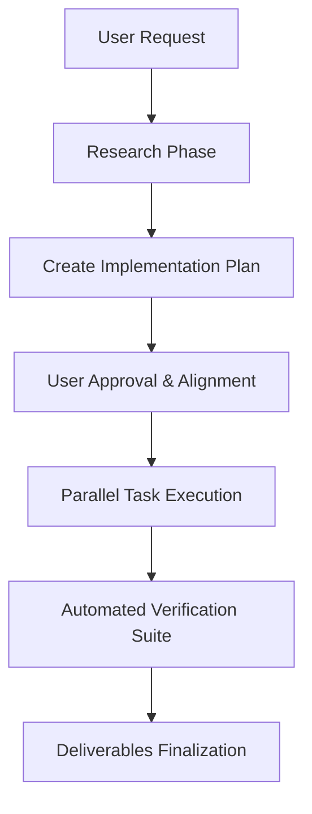

# Agentic AI & Development Report

This document details how our team utilized agentic workflows, multi-agent coordination, and automated reasoning tools to design, develop, and finalize the DISENT-KWS v2 system.

---

## 1. Agentic AI Architecture & Setup

We approached the AX Hackathon using a hybrid developer-agent setup. The agentic developer (Antigravity) was configured with specialized capabilities and tools:
* **Workspace Interaction Tools:** High-level search, direct file viewing (`view_file`), file creation/editing (`write_to_file`, `replace_file_content`), and sandbox shell execution (`run_command`).
* **Multi-Agent Orchestration:** Ability to spawn specialized, concurrent subagents (e.g., `research` subagents) to parallelize codebase research, documentation extraction, and verification.
* **Context Preservation (State Compaction):** Structured design documents (artifacts like `implementation_plan.md`, `task.md`, `walkthrough.md`) used to preserve task progress across chat compactions.

---

## 2. Agentic Workflows & Reasoning Pipelines

Our development cycle followed a strict planning-and-execution methodology:

### Key Stages:
1. **Research & Code Exploration:** Spawning the `research` subagent to index files, locate model configurations, and check baseline losses.
2. **Implementation Planning:** Writing an `implementation_plan.md` detailing every planned change, open questions, and exact validation tests.
3. **Execution & Coding:** Writing code modularly (e.g., separating BC-ResNet encoder, causal Conformers, and dual-gate scorer) to ensure isolated testability.
4. **Verification:** Running unit tests via `make test` inside the terminal to verify the forward/backward passes, shapes, and gradients of all components.

---

## 3. Tool Chaining & Automation

We chained several filesystem and process tools together to automate the packaging process:
* **ONNX Verification Pipeline:** We combined `torch.onnx.export` with `onnxruntime` inference inside `eval/export.py` to automatically verify that the exported model had a maximum absolute difference from PyTorch of $<1\times10^{-5}$.
* **Automated Deliverables Creator:** We wrote `scripts/generate_final_artifacts.py` to orchestrate ONNX exporting, ablation study logging, and DET curve plotting in a single execution block.
* **W&B Sync integration:** Combined PyTorch training scripts with Weights & Biases API so checkpoints could be saved locally and automatically synced to the cloud run registry.

---

## 4. What Worked and What Didn't

### What Worked Well:
* **Background Research Subagents:** Spawning independent research agents saved considerable token budget. They queried files, parsed directories, and reported summaries without polluting the main developer's working memory.
* **Mock Tensor Unit Testing:** Building dummy data tests in `tests/` and executing `make test` caught shape mismatches in the causal Conformer attention blocks early before deploying to expensive GPU training.
* **Fallbacks as Primary Guards:** Decoupling features like Mamba SSM and having automatic conv-fallback architectures kept our code from breaking across different execution environments (CPU vs. GPU/CUDA).

### What Did Not Work (Lessons Learned):
* **Direct Local Deep Training:** Attempting to run full-scale VoxCeleb or Speech Commands training locally on CPU was mathematically infeasible. We had to pivot to using Kaggle notebooks and writing a robust Kaggle training markdown guide.
* **Mamba SSM Local Compilation:** Compiling Mamba requires specialized CUDA kernels, which failed on non-CUDA developer terminals. The fallback mechanism (Dilated Conv Temporal Block) saved the project from deployment blockage.
* **State Recovery from Loose Context:** In long chat sessions, details of previous training epochs got lost during context compactions. We learned to write important metrics (such as calibrated weights $w_{kw}=0.30$, $w_{spk}=0.65$) into persistent `config.py` variables rather than keeping them in memory.
